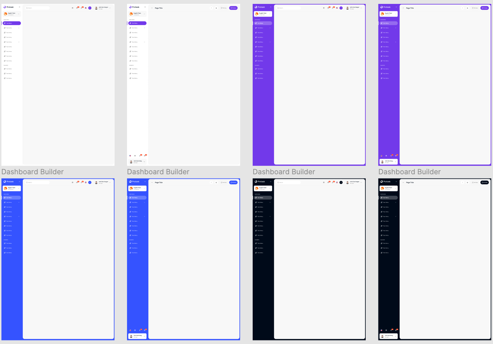

# Forge

面向 SaaS 后台和 ToB 业务系统的开源 React 组件库与模板工程。

Forge 把团队做后台产品时反复重建的东西整理成一套可直接使用的工程资产：设计 token、React 组件、AppLayout、数据密集型 UI、完整业务模板，以及一份给 AI coding agent 使用的 Forge Skill。

**目标：让人和 AI 都能基于同一套组件规则，稳定地交付专业、统一、可维护的后台界面。**



## 快速开始

### 开发者接入

如果是新项目，推荐先从最小模板开始：

```bash
git clone https://github.com/forge-ui/forge-starter.git
cd forge-starter
pnpm install
pnpm dev
```

如果要在已有 Next.js / Tailwind v4 项目里接入组件库：

```bash
pnpm add @forge-ui-official/core
pnpm add -D tailwindcss @tailwindcss/postcss
```

在 Tailwind v4 入口 CSS 中引入 Forge 样式，并让 Tailwind 扫描组件包产物：

```css
@import "tailwindcss";
@import "@forge-ui-official/core/styles.css";
@source "../../node_modules/@forge-ui-official/core/dist";
```

`@source` 的相对路径取决于你的 CSS 文件位置。如果入口文件不在
`src/app/globals.css`，按实际目录调整到 `node_modules/@forge-ui-official/core/dist`。

最小页面示例：

```tsx
import { AppLayout, DataTable, SurfaceCard, Button } from "@forge-ui-official/core";

const columns = [
  { key: "name", title: "客户" },
  { key: "status", title: "状态" },
  { key: "owner", title: "负责人" },
];

const rows = [
  { id: "1", name: "华东零售事业部", status: "待复核", owner: "张敏" },
];

export default function CustomersPage() {
  return (
    <AppLayout pageTitle="客户运营" logoText="Acme">
      <SurfaceCard title="风险客户">
        <DataTable columns={columns} rows={rows} />
        <Button>新建客户</Button>
      </SurfaceCard>
    </AppLayout>
  );
}
```

### AI 快速接入

Forge 的推荐 AI 工作流是：Product Design 负责产品意图和页面方案，Forge starter
负责干净工程落地，`@forge-ui-official/core` 负责视觉和组件基线，`forge-app-design`
负责 Forge 约束、实现辅助、截图验证和模式沉淀。

给 Codex / Claude / Cursor 的起始提示可以直接这样写：

```text
用 Product Design 设计一个中文 SaaS 后台，输出 3 个页面的 Page Intent Specs、IA 和组件计划。
然后用 Forge starter + @forge-ui-official/core 实现，优先使用 ForgeUI 组件，不要手写基础 Button/Card/Table 样式。
页面布局可以按业务需要发散，但基础颜色、字体、圆角、边框、密度和响应式行为必须遵循 ForgeUI。
完成后运行 typecheck/build，并给出页面截图。
```

AI 写页面时要遵守几条硬规则：

- 组件只从 `@forge-ui-official/core` 引入，基础 Button/Card/Table/Form/Layout 不要手搓。
- 应用壳优先使用 `AppLayout`，不要临时拼 sidebar、topbar、profile 区。
- 颜色、字号、圆角、边框和密度优先相信 ForgeUI 默认值；业务页面不要用固定宽度、固定高度或自定义大字号覆盖组件基线。
- Card、table、rail、dashboard block 默认自适应父级布局；如果出现大空隙，先修 grid/flex 轨道，不要把 card 宽度写死。
- 生成后至少跑 `pnpm typecheck`、`pnpm build`，需要插件验收时再跑 `pnpm forge-app-design:validate`。

## 你可以用它做什么

- **搭后台产品**：订单、商品、客户、项目、成员、文件、发票、详情页、新建页、编辑页等常见业务页面都有模板可参考。
- **搭 SaaS 控制台**：内置多套 dashboard 组合，覆盖电商、财务、项目管理、CRM、分析看板等场景。
- **搭统一设计系统**：组件、颜色、字体、圆角、阴影和交互状态统一由 `@forge-ui-official/core` 提供。
- **让 AI 写得更稳**：Forge Skill / `forge-app-design` 会约束 AI 优先使用组件、token、布局和模板，而不是临时手搓 UI。

## 核心能力

- **React 组件库**：Button、Form、DataTable、Calendar、Chart、Card、Toolbar、Dialog、Tooltip、File、Avatar 等后台高频组件。
- **应用级布局**：`AppLayout` 内置 sidebar、topbar、profile、notification、language switcher、team switcher 和 page header。
- **业务模板**：电商后台、项目管理后台、dashboard builder、登录流程、详情页、创建/编辑流程、发票页。
- **Tailwind v4 设计 token**：通过 `@forge-ui-official/core/styles.css` 暴露 Forge 的颜色、排版和组件样式。
- **AI-ready 工作流**：面向 Codex、Claude Code、Cursor 等工具的可安装 Skill。

## 安装

```bash
pnpm add @forge-ui-official/core
```

Tailwind v4 入口 CSS 必须引入 Forge 样式，并让 Tailwind 扫描组件包产物：

```css
@import "tailwindcss";
@import "@forge-ui-official/core/styles.css";
@source "../node_modules/@forge-ui-official/core/dist";
```

`@source` 的相对路径取决于你的 CSS 文件位置。如果入口文件在 `src/app/globals.css`，通常需要写成：

```css
@source "../../node_modules/@forge-ui-official/core/dist";
```

## 使用示例

```tsx
import { AppLayout, Button, DataTable } from "@forge-ui-official/core";

export default function OrdersPage() {
  return (
    <AppLayout pageTitle="Orders" logoText="Acme">
      <Button>New Order</Button>
      <DataTable columns={[]} rows={[]} />
    </AppLayout>
  );
}
```

## 仓库结构

| 路径 | 说明 |
|---|---|
| `core/` | `@forge-ui-official/core` 组件库源码 |
| `src/app/docs` | 文档页面 |
| `src/app/components` | 组件展示与变体 |
| `src/app/cases` | 组件组合案例 |
| `src/app/templates` | 完整后台模板和业务页面 |
| `.agents/skills/forge` | Forge UI Kit skill，用于在本仓和 starter 中写业务页面 |
| `plugins/forge-app-design` | Codex 侧 Forge 原型设计插件、规则、样例、验收和 intake 资产 |
| `public/` | 图片、图标和安装脚本 |

## 本地开发

```bash
pnpm install
pnpm dev
```

常用命令：

```bash
pnpm build           # 构建组件包和文档/示例站
pnpm typecheck       # 检查组件包和站点类型
pnpm core:build      # 只构建 @forge-ui-official/core
pnpm core:typecheck  # 只检查组件包类型
pnpm lint            # 运行 ESLint
```

## Forge Skill

安装 Forge Skill 后，AI coding agent 会更倾向于复用 Forge 组件、token、布局和模板，减少临时拼 UI 带来的样式漂移。Codex 场景下，推荐同时使用 `forge-app-design` 插件作为 Product Design 到 Forge starter 的落地与验收层。

```bash
# Claude Code / Cursor
curl -fsSL https://forgeui.org/install-skill.sh | bash

# Codex
curl -fsSL https://forgeui.org/install-skill.sh | FORGE_AGENT=codex bash
```

如果官网域名暂时不可用，也可以直接从 GitHub 安装：

```bash
curl -fsSL https://raw.githubusercontent.com/forge-ui/forge/main/public/install-skill.sh | FORGE_AGENT=codex bash
```

## 相关项目

- [`forge-starter`](https://github.com/forge-ui/forge-starter)：最小 Next.js 起手模板。
- [`forge-agent`](https://github.com/forge-ui/forge-agent)：基于 Forge 构建的 AI Agent 产品壳示例。

## License

MIT
