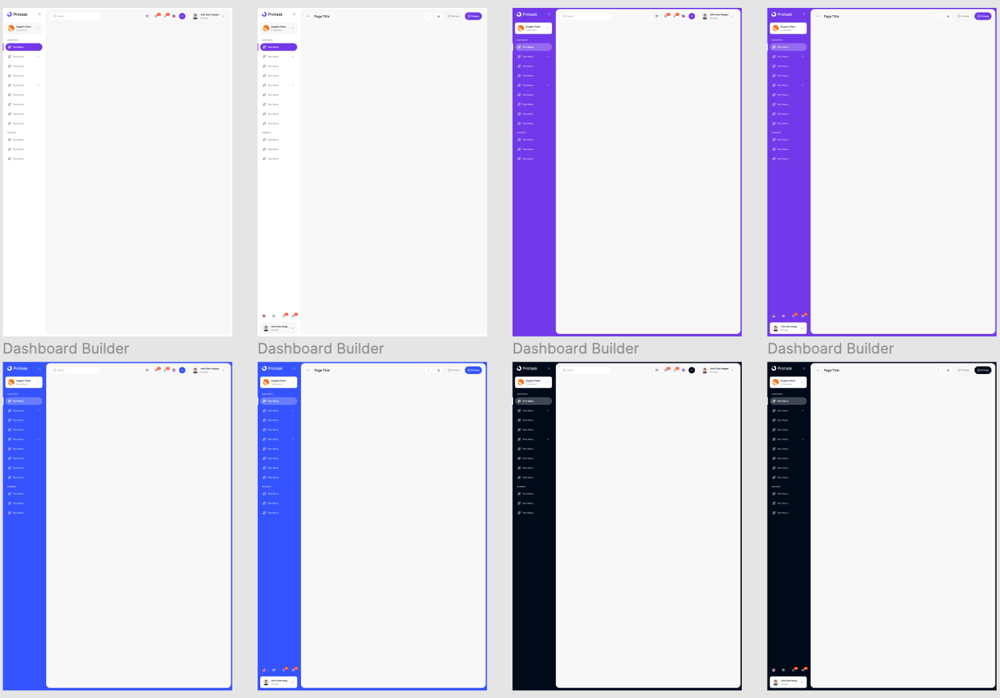

# Forge

面向 SaaS 后台和 ToB 业务系统的开源 React 组件库与模板工程。

Forge 把团队做后台产品时反复重建的东西整理成一套可直接使用的工程资产：设计 token、React 组件、AppLayout、数据密集型 UI、完整业务模板，以及一份给 AI coding agent 使用的 Forge Skill。

**目标：让人和 AI 都能基于同一套组件规则，稳定地交付专业、统一、可维护的后台界面。**



## 快速开始

**太长不看版，直接粘给Codex，快速开始**

<details>
<summary>展开完整提示词，一键复制给 Codex</summary>

```text
请用 Forge 生态创建一个新的后台原型项目。

Forge 仓库地址：https://github.com/forge-ui/forge
Forge Starter 地址：https://github.com/forge-ui/forge-starter
Forge Design Extension 地址：https://github.com/forge-ui/forge-design-extension

请先确认本地已经安装或可读取 Forge Skill。
然后 clone Forge Starter 并初始化环境。
请确认项目已经安装 @forge-ui-official/core；如果 starter 没有带上，请执行 pnpm add @forge-ui-official/core。
同时确认入口 CSS 已引入 @forge-ui-official/core/styles.css，并且 Tailwind v4 已配置 @source 指向 @forge-ui-official/core/dist。
最后确认 pnpm dev、pnpm typecheck、pnpm build 都可用。

环境就绪后，先主动向我确认业务目标、用户角色、需要的页面/模块、核心数据对象、主要操作流程和验收标准。
我确认后，再开始设计并实现业务模块。

实现时请使用 Forge Skill；快开走 Forge Starter，在真实页面上改 UI 走 Forge Design Extension：
- Forge Skill 负责约束组件库、token、AppLayout 和基础样式。
- Forge Starter 负责后台壳、登录、业务样板和加模块流程。
- Forge Design Extension 负责在真实 Chrome 页面上点选、放置 Forge 组件并改界面。

页面实现优先使用 AppLayout 和 ForgeUI 组件，不要手写基础 Button/Card/Table/Form/Layout 样式。
页面布局可以按业务需要设计，但基础颜色、字体、圆角、边框、密度和响应式行为必须遵循 ForgeUI。

完成后运行 pnpm typecheck 和 pnpm build，并给出可访问地址、页面截图和剩余问题。
```

</details>

新项目推荐直接从 starter 开始：

```bash
git clone https://github.com/forge-ui/forge-starter.git
cd forge-starter
pnpm install
pnpm dev
```

已有 Next.js / Tailwind v4 项目接入组件库：

```bash
pnpm add @forge-ui-official/core
pnpm add -D tailwindcss @tailwindcss/postcss
```

在入口 CSS 中加入：

```css
@import "tailwindcss";
@import "@forge-ui-official/core/styles.css";
@source "../../node_modules/@forge-ui-official/core/dist";
```

然后直接使用组件：

```tsx
import { AppLayout, Button, DataTable, SurfaceCard } from "@forge-ui-official/core";
```

更完整的 AI 约束在 Forge Skill 里。新项目快开走 [Forge Starter](https://github.com/forge-ui/forge-starter)；在已跑起来的页面上点选、放置组件或改 UI，用 [Forge Design Extension](https://github.com/forge-ui/forge-design-extension)。

## 你可以用它做什么

- **搭后台产品**：订单、商品、客户、项目、成员、文件、发票、详情页、新建页、编辑页等常见业务页面都有模板可参考。
- **搭 SaaS 控制台**：内置多套 dashboard 组合，覆盖电商、财务、项目管理、CRM、分析看板等场景。
- **搭统一设计系统**：组件、颜色、字体、圆角、阴影和交互状态统一由 `@forge-ui-official/core` 提供。
- **让 AI 写得更稳**：Forge Skill 约束组件、token、布局和模板；Forge Starter 提供快开脚手架；Forge Design Extension 在真实页面上点选和改 UI。

## 核心能力

- **React 组件库**：Button、Form、DataTable、Calendar、Chart、Card、Toolbar、Dialog、Tooltip、File、Avatar 等后台高频组件。
- **应用级布局**：`AppLayout` 内置 sidebar、topbar、profile、notification、language switcher、team switcher 和 page header。
- **业务模板**：电商后台、项目管理后台、dashboard builder、登录流程、详情页、创建/编辑流程、发票页。
- **Tailwind v4 设计 token**：通过 `@forge-ui-official/core/styles.css` 暴露 Forge 的颜色、排版和组件样式。
- **AI-ready 工作流**：面向 Codex、Claude Code、Cursor 等工具的可安装 Skill。

## 仓库结构

| 路径 | 说明 |
|---|---|
| `core/` | `@forge-ui-official/core` 组件库源码 |
| `docs/for-agents/` | **给 AI 的组件路由表 + 介绍表**（先读 `README.md`） |
| `src/app/docs` | 文档页面 |
| `src/app/components` | 组件展示与变体 |
| `src/app/cases` | 组件组合案例（活文档，props 以源码为准） |
| `src/app/templates` | 完整后台模板和业务页面 |
| `.agents/skills/forge` | Forge UI Kit skill，用于在本仓和 starter 中写业务页面 |
| `public/` | 图片、图标和安装脚本 |

## 本地开发

```bash
pnpm install
pnpm dev
```

常用命令：

```bash
pnpm build           # 构建组件包和文档/示例站
pnpm typecheck       # 检查组件包和站点类型
pnpm core:build      # 只构建 @forge-ui-official/core
pnpm core:typecheck  # 只检查组件包类型
pnpm lint            # 运行 ESLint
```

## 给 AI 的组件目录

写业务页前让 Agent 读：

- [`docs/for-agents/README.md`](./docs/for-agents/README.md) — 总入口  
- [`docs/for-agents/routes.md`](./docs/for-agents/routes.md) — `/cases/*` 路由表  
- [`docs/for-agents/components.md`](./docs/for-agents/components.md) — 组件用途 + 对应 case  

全量 export 机器清单见 `docs/for-agents/inventory.json`（与 forge-readdy catalog 同源可刷新）。

## Forge Skill

安装 Forge Skill 后，AI coding agent 会更倾向于复用 Forge 组件、token、布局和模板，减少临时拼 UI 带来的样式漂移。新后台从 [Forge Starter](https://github.com/forge-ui/forge-starter) 快开；要在真实页面上点选组件、放置组件或改界面，用 [Forge Design Extension](https://github.com/forge-ui/forge-design-extension)。

```bash
# Claude Code / Cursor
curl -fsSL https://forgeui.org/install-skill.sh | bash

# Codex
curl -fsSL https://forgeui.org/install-skill.sh | FORGE_AGENT=codex bash
```

如果官网域名暂时不可用，也可以直接从 GitHub 安装：

```bash
curl -fsSL https://raw.githubusercontent.com/forge-ui/forge/main/public/install-skill.sh | FORGE_AGENT=codex bash
```

## Forge Design Extension

[Forge Design](https://github.com/forge-ui/forge-design-extension) 是 Forge 的设计工具：Chrome 插件 + 本机桥接。它不替代组件库，也不替代 Starter。**Starter 负责快开后台，Design Extension 负责在已经跑起来的页面上做设计。**

打开自己的应用，点一下要改的地方，侧边栏里的本地模型带着真实 selector 改文案、样式、交互，或把 Forge 组件写入源码。也可以从组件盘拖到锚点旁，确认后再写入项目。页面内容留在本机，不经过云端。

安装与用法见独立仓 README：启动本机桥接，在 Chrome 加载 `extension/`，然后在真实页面上点选或放置。

## 相关项目

- [`forge-starter`](https://github.com/forge-ui/forge-starter)：后台快开脚手架，带登录、样板模块和加页流程。
- [`forge-design-extension`](https://github.com/forge-ui/forge-design-extension)：在真实 Chrome 页面上点选、放置组件并改 UI。
- [`forge-agent`](https://github.com/forge-ui/forge-agent)：基于 Forge 构建的 AI Agent 产品壳示例。
- [`forge-design-extension`](https://github.com/forge-ui/forge-design-extension)：在真实 Chrome 里点选或放置组件，用本地 Grok 改界面。

## License

MIT
